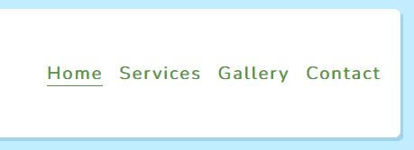
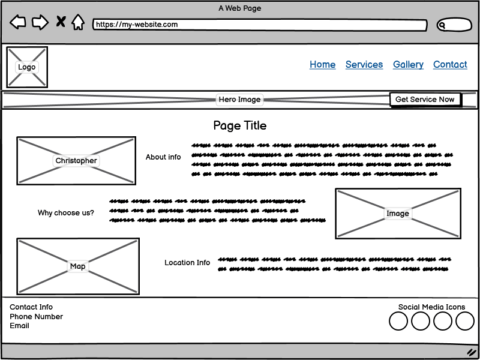
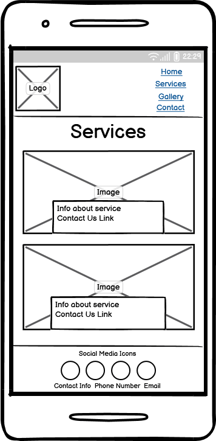
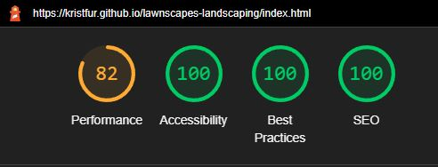

# Lawnscapes Landscaping

Lawnscapes Landscapign is a website that is designed for users how are looking for landscaping services in Wexford, Ireland. The site is targeted towards homeowners, and businesses who are in need of a range of landscaping services from lawn cutting to weeding. The site is designes with a wide range of demographics in mind, it is easy to navigate and everything is just one click away.

Click [here](https://kristfur.github.io/lawnscapes-landscaping/) to view the live site.

# Features
## Site wide
- Navigation Menu
    - Menu containes links for home, services, gallery and contact pages.
    - Allows users to easily navigate the website, and it shows what page the user is currently on
    - Menu is responsive for all screen sizes

- Footer
    - Footer contains contact information for Lawnscapes Landscaping and social media icons
    - The socila media icons will open a new tab when clicked, and bring the user to the social media account for Lawnscapes Landscaping.
    - Footer is present on all web pages
    - Allows user to easliy find our company on social media 

- Favicon
    - Favicon has reconisable company logo
    - Allows the user to easily identify website from browser tabs

- 404 page
    - 404 page will show if user navigates to a broken link
    - Page tells user the link is invalid and provides link to retur to home page

## Home page
 - Hero image
    - This image is the first thing the user sees when the come to the website, it shows the user what the website is about
    - The image pans from right to left on smaller screens, and zooms out on larger screens to show user the whole image and to bring life to the website
    - The image has a call-to-action block of text that the user can click to go to the services page for easy navigation

- Company information blocks
    - The home page has three information blocks that give the user knowledge about the company
    - Each block of text is accompanied by a related image to add to the user experience

## Services
- Service information blocks
    - This page consists of blocks that provide information on each service that is offered
    - Each block has the service name, a related image as the background and some text describing what is included with the service
    - The text on each block is clickable and will bring the user to the contact us page for ease of navigation

## Gallery
- Masonry style gallery
    - This page gives the user images of the work done by our company
    - The images are arranged in a masonry style and are responsive to the screen size

## Contact
- Contact Us from
    - This contact form is for the users to contact the company about getting a service, and the company can get their information to contact them back
    - The form consists of the following elements:
        - First Name (required, type=text)
        - Last Name (required, type=text)
        - Phone Number (required, type=text)
        - Email Address (required, type=email)
        - Address (required, type=text)
        - Service (required, options are listed below)
            - Lawn Cut (type=checkbox)
            - hedge Trim (type=checkbox)
            - Weeding (type=checkbox)
            - Leaf Raking (type=checkbox)
            - Waste Removal (type=checkbox)
            - Other (type=checkbox)
        - Comments (optional, type=textarea)
        - Submit and Reset buttons
    - Once all required elements are filled correctly and the user clicks submit, they will be brought to a Thank You page
    - The Thank You page provides the user with a link back to the home page, but also lets them know that they can call us now if they dont want to wait for the company to get back to them

## Exsisting Features
- Responsive design
- Easy and intuitive to navigate
- Contact form and thank you page
- 404 page for invalid links
- 5 services for user to choose from

## Features To Implement
- Checkboxes in contact form are automaticaly selected when user clicks on a service on services page
- Database of users info for company and alert/email system for when a user submits a contact form
- Email and phone number in footer are clickable and open an email/phone platform for user to immediately and easily contact company
- Ability for images in gallery to enlarge when clicked

# Design
## Wireframes
Home page

Services page

Gallery page

Contact page

Thank You page

404 page

# Technologies
- HTML
    - The structure of website was built with HTML code

- Css
    - The website was styled with a CSS file

- Gitpod
    - The website was developed using [gitpod.io](https://gitpod.io)

- GitHub
    - The source code is hosted on [GitHub](https://github.com/Kristfur/lawnscapes-landscaping) and deployed with Git Pages ([Link to live website](https://kristfur.github.io/lawnscapes-landscaping/))

- Git
    - Used for version control during the development of the website

- Dev Tools
    - Used throughout the development process to test code with instant response time

- Font Awesome
    - Icons for the social media in footer were obtained from [https://fontawesome.com/](https://fontawesome.com/)

- Favicon.io
    - Favicon files were created by [https://favicon.io/](https://favicon.io/)

- balsamiq
    - Wireframe diagrams were created using [balsamiq](https://balsamiq.com/)

- remove.bg
    - Whitespace in logo background was removed with [https://www.remove.bg/](https://www.remove.bg/)

- iloveimg
    - Images size (width/height) was reduced with [https://www.iloveimg.com/](https://www.iloveimg.com/)

- tinyjpg
    - Images file size was reduced with [https://tinyjpg.com/](https://tinyjpg.com/)

# Testing
## Responsiveness
All website pages were tested for responsiveness on screen sizes of 320px and above on Firefox, Chrome, Edge and Opera browsers.

Steps taken:
1. Open browser and go to the link [https://kristfur.github.io/lawnscapes-landscaping/](https://kristfur.github.io/lawnscapes-landscaping/)
2. Open developer tools by pressing CTRL+SHIFT+I on the keyboard
3. Toggle device toolbar and set width to 320px
4. Drag window to maximum width

Expected:
The website is responsive and all elements are on screen and not overlapping, the images are not pixelated or stretched.

Actual:
Website behaved as expected

The website was also tested on the following devices for responsiveness:
- iPhone 8 (behaved as expected)

## Accessibility
The [Wave Accessibility](https://wave.webaim.org/) tool was used for accessibility testing. 

Testing was focused on the following:
- All image elements had an alt description for a screen reader to read out
- All forms have lebels for each input for a screen reader to read out
- All links to external pages have proper aria labels
- Color contrast for text meets the minimum ratio

Multiple accessibility issues were found, but were promptly resolved.

Issue #1: Color contrast of the smaller text did not meet the minimum ratio

Fix: The text color was changed from #578e44 to #41612e to meet the minimum requirement

Issue #2: All of the images on the services page lacked an alt description:

Fix: All images recieved appropiate alt descriptions

## Lighthouse Testing

## Functional Testing

### Navigation Links

Every navigation link was tested to ensure they work as intended. Tests were done by hovering over, thenclicking on each navigation link.

- Home -> index.html
- Services -> services.html
- Gallery -> gallery.html
- Contact -> contact.html

All links behaved as expected, they redirected the user to the correct page and reacted correctly to the hover action.

### Social Media Links in Footer
Each social media link was tested by hovering over, then clicking the corrosponding icon.

Every link worked as expected, and the icons reacted correctly to the hover action.

### Hero image CTA text

The call to action text overlayed on top of the hero image on the home page was tested to ensure it redirected to the services.html page.

The link behaved as espected and redirected the user to the correct page.

### Services links

Each link in the services page was tested to make sure they redirected to the contact.html page.

Every link behaved as espected and redirected the user to the correct page.

### Contact Form Testing
The contact foorm was thoroughly tested to ensure correct use and behaviour. The following is the testing process:

*Correct inputs* 

Steps taken:

1. Navigate to the [contact page](https://kristfur.github.io/lawnscapes-landscaping/contact.html)
2. Fill the form as follows:
    - First Name: John
    - Last Name: Doe
    - Phone Number: 01 123 456 789
    - Email Address: john.doe@email.com
    - Address: 1 Church Road, Wexford
    - Lawn Cut: Selected
    - Comments: This is a comment
3. Click the submit button

Expected:

Form submits without errors and user is redirected to [submit.html](https://kristfur.github.io/lawnscapes-landscaping/submit.html) page

Actual: 

Website behaved as expected, the form submitted and the user was redirected.

*Missing required First Name* 

Steps taken:

1. Navigate to the [contact page](https://kristfur.github.io/lawnscapes-landscaping/contact.html)
2. Fill the form as follows:
    - First Name:
    - Last Name: Doe
    - Phone Number: 01 123 456 789
    - Email Address: john.doe@email.com
    - Address: 1 Church Road, Wexford
    - Lawn Cut: Selected
    - Comments: This is a comment
3. Click the submit button

Expected:

Form does not submit, but displays an error telling the user that the First Name field is required.

Actual: 

Website behaved as expected, form did not submit but displayed an error.

*Missing required Last Name* 

Steps taken:

1. Navigate to the [contact page](https://kristfur.github.io/lawnscapes-landscaping/contact.html)
2. Fill the form as follows:
    - First Name: John
    - Last Name: 
    - Phone Number: 01 123 456 789
    - Email Address: john.doe@email.com
    - Address: 1 Church Road, Wexford
    - Lawn Cut: Selected
    - Comments: This is a comment
3. Click the submit button

Expected:

Form does not submit, but displays an error telling the user that the Last Name field is required.

Actual: 

Website behaved as expected, form did not submit but displayed an error.

*Missing required Phone Number* 

Steps taken:

1. Navigate to the [contact page](https://kristfur.github.io/lawnscapes-landscaping/contact.html)
2. Fill the form as follows:
    - First Name: John
    - Last Name: Doe
    - Phone Number:
    - Email Address: john.doe@email.com
    - Address: 1 Church Road, Wexford
    - Lawn Cut: Selected
    - Comments: This is a comment
3. Click the submit button

Expected:

Form does not submit, but displays an error telling the user that the Phone Number field is required.

Actual: 

Website behaved as expected, form did not submit but displayed an error.

*Missing required Email Address* 

Steps taken:

1. Navigate to the [contact page](https://kristfur.github.io/lawnscapes-landscaping/contact.html)
2. Fill the form as follows:
    - First Name: John
    - Last Name: Doe
    - Phone Number: 01 123 456 789
    - Email Address:
    - Address: 1 Church Road, Wexford
    - Lawn Cut: Selected
    - Comments: This is a comment
3. Click the submit button

Expected:

Form does not submit, but displays an error telling the user that the Email Address field is required.

Actual: 

Website behaved as expected, form did not submit but displayed an error.

*Invalid Email Address* 

Steps taken:

1. Navigate to the [contact page](https://kristfur.github.io/lawnscapes-landscaping/contact.html)
2. Fill the form as follows:
    - First Name: John
    - Last Name: Doe
    - Phone Number: 01 123 456 789
    - Email Address: johnDoe
    - Address: 1 Church Road, Wexford
    - Lawn Cut: Selected
    - Comments: This is a comment
3. Click the submit button

Expected:

Form does not submit, but displays an error telling the user that the Email Address is invalid.

Actual: 

Website behaved as expected, form did not submit but displayed an error.

*Missing required Address* 

Steps taken:

1. Navigate to the [contact page](https://kristfur.github.io/lawnscapes-landscaping/contact.html)
2. Fill the form as follows:
    - First Name: John
    - Last Name: Doe
    - Phone Number: 01 123 456 789
    - Email Address: john.doe@email.com
    - Address:
    - Lawn Cut: Selected
    - Comments: This is a comment
3. Click the submit button

Expected:

Form does not submit, but displays an error telling the user that the Address field is required.

Actual: 

Website behaved as expected, form did not submit but displayed an error.

## Validator Testing

- HTML 
    - No errors showed up when checking with the [W3C Validator](https://validator.w3.org/)

- CSS
    - No errors showed up when checking with the [(Jigsaw) Validator](https://jigsaw.w3.org/css-validator/)

## Unfixed Bugs
Currently there are no know bugs, if you happen to come across a bug, please let me know and I will address it in a future release.

# Deployment

## Version Control
This website was pushed to GitHub to the remote repository 'lawnscapes-landscaping'.

The following Git commands were used throughput development:

    git add <file> 

Was uesd to add files to the staging area before they are commited

    git commit -m "commit message"

Was used to commit changes to the local repository queue

    git push

Was uesd to push all committed code to the remote repository on GitHub

## Deployment to GitHub Pages
This website was deployed to GitHub Pages, the steps to deployment are:
1. In the GitHub repository, navigate to settings
2. In settings, navigate to Pages
3. In the source section, select the branch *main*
4. Click 'save'
5. The live website link will appear near the top of the page after some time

The live linke can be found here [https://kristfur.github.io/lawnscapes-landscaping/](https://kristfur.github.io/lawnscapes-landscaping/)

## Clone the repository Code Locally

The steps to clone the repository are as follows:

1. From the repository, click the *code* drop down menu
2. Click on *HTTPS*
3. Copy the link
4. Open your IDE (that had git installed)
5. Paste the git command into the IDE terminal
6. The project is now clones on your local machine

## Credits

[Tacos Travels](https://github.com/Gareth-McGirr/tacos-travels)
- Elements of this project were used as a referance for my website and documentation. 

### Media

Website logo was created by me using Canva.

Image of map of Ireland was taken from Wikipedia.

The remainder of the images were taken from [Pexels](https://www.pexels.com/) (-p) and [Unsplash](https://unsplash.com/) (-u).

